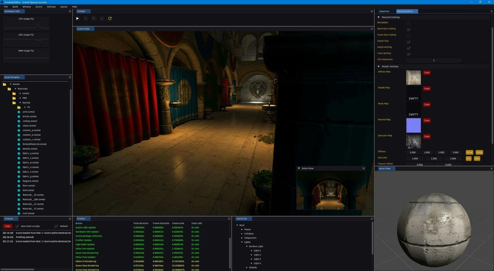
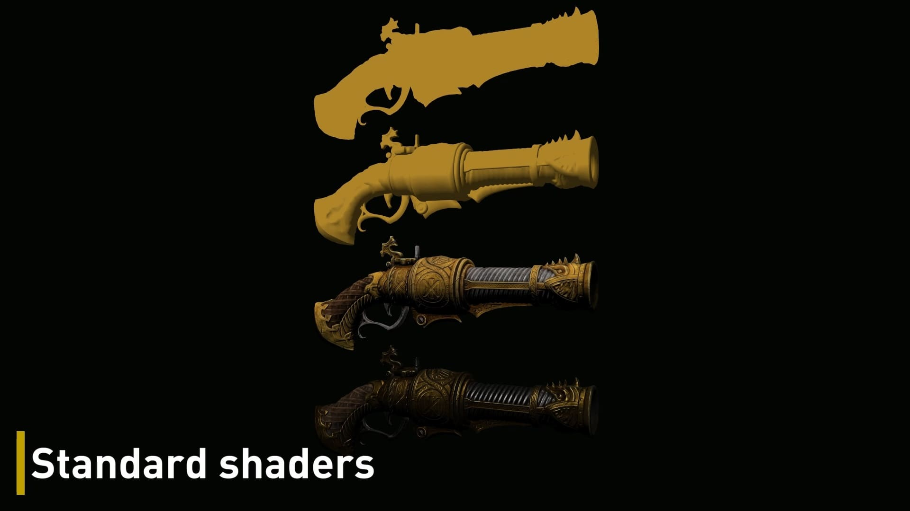
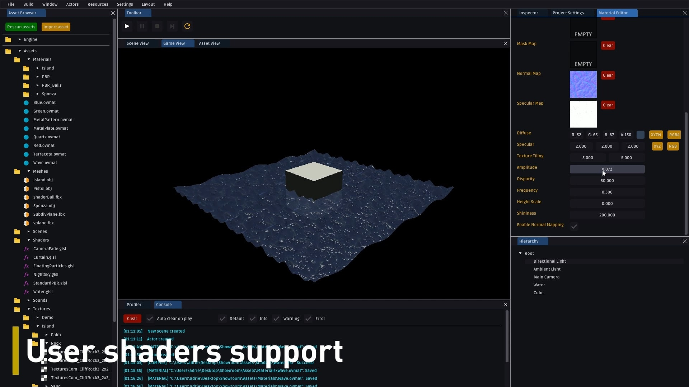
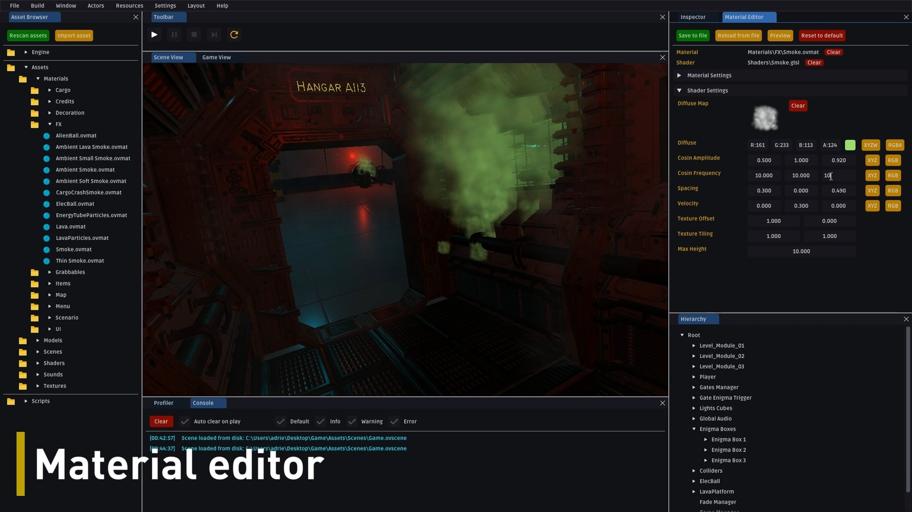
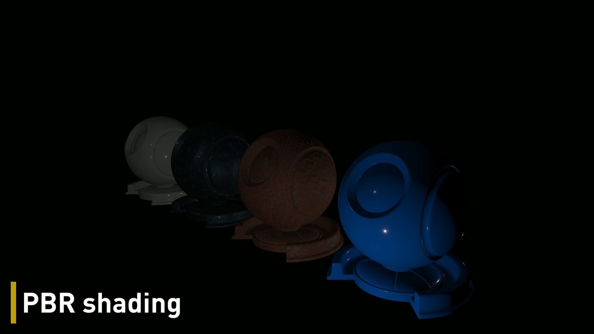
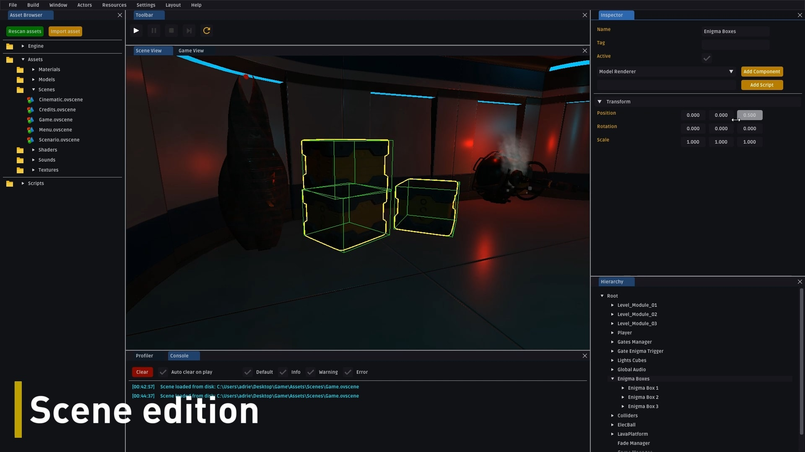

## Context
Overload is a graduation project. We were 3 ([Benjamin VIRANIN](https://github.com/BenjaminViranin), [Adrien GIVRY](https://github.com/adriengivry) and me) working on during 5 months.
We had to create a game engine from scratch, using the fewest libraries possible.

## Team goals
Our goals for this project were:
- Understanding how to architect a game engine
- Designing an application thinking of end-users
- Making a game engine as simple as possible
- Producing high-quality modern code
- Creating a game with our engine
- Dealing with a long-term project
- Developping documentation for developers and end-users

## Personnal goals
My personnal goals for this project were:
- Improving my 3D rendering skills
- Improving my Programming Architecture skills
- Improving my usage of modern CPP

## Software used
- Visual Studio 2017 and 2019 to code

## Libraries used
- OpenGL with GLEW (Graphics API)
- GLFW (Windowing and inputs)
- Assimp (3D model loader)
- Bullet3 (Physics)
- irrKlang (Audio)
- Tinyxml2 (XML Serializer)
- SOL2 (Lua binder)
- imGui (GUI)

## Pre-production
We spent about a month designing our initial architecture. We tried to provide a technical solution with UML diagrams, flowcharts, package diagrams and use-case diagrams. This was a long and tedious work, but it really helped us to start the production with a clear vision of the engine. We defined some coding convention to ensure that all of our work will stay homogeneous during the production. Defining these kinds of rules is crucial to keep a maintainable code during the whole project.

## Production
The production made us realize that we had a naive idea of what a game engine is. During this phase our architecture has evolved. We found that our initial architecture was sometimes too complex, non-optimal. We went back to architecture design multiple times during the project.

## Modules
Our final solution is divided into 12 modules:
- OvAnalytics: Code and hardware profiling
- OvDebug: Logging, assertions
- OvTools: Serialization, ini files, events, time
- OvMaths: Vectors, Matrices, Quaternion, Transform
- OvAudio: Wraps irrKlang
- OvPhysics: Wraps Bullet3
- OvRendering: Rendering engine using OpenGL
- OvWindowing: GLFW + Windows API wrapper
- OvUI: imGui wrapped into an event-based and component-based UI system
- OvCore: Mediator, resource management, scripting, component-based scene system
- OvGame: Uses OvCore, asset dependent, generic executable for any game built with Overload
- OvEditor: Uses OvCore, expose game development to the end-user (From creation to build)

## Team organization
At the beginning of the project we decided to split the main tasks like this:
- Core and editor: [Adrien GIVRY](https://github.com/adriengivry)
- Physics and audio: [Benjamin VIRANIN](https://github.com/BenjaminViranin)
- Rendering and Serialization: Me

But the more the project progressed, the more we moved. We all worked on every parts of the engine, and it was a good way to expand our areas of expertise.

## Features
We end-up this project with much more features than we expected. We used an iterative strategy, meaning that we developped our modules as simple as possible in order to quickly have results. We then iterated over and over to add new features.

## Game
We made a game with our engine to demonstrate its capabilities. Our game has a complete game loop (Menu, story, cinematic, game, credits).

## Source code
Sources are private, but you can contact me by email to see them: maxbrundev@gmail.com

## More information
If you are interested in Overload, you can download our engine and the demo game we made with it on our website: 
http://overloadengine.org  
You can also watch our features reel on YouTube: 
https://www.youtube.com/watch?v=ARXSJh-ZMHM 

## Images

